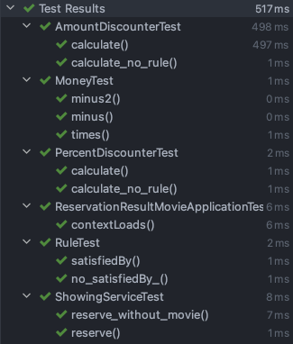

# 아키텍처와 객체지향
조영호 님  

## 목표
* 제시한 내용을 토대로 설계, 구현해보자

## 진행상항
[O] Showing  
[O] Movie  
[O] Discounter  
[O] DiscounterRule  
[ ] Reservation

## 다음 작업
* Reservation 클래스 테스트 & 구현 코드 작성
* 통합 테스트 코드 작성
* test 로 작성한 소스 패키징후 main 경로 이동
* JPA 적용하여 테스트 작성

## UML
reservation-movie.drawio 파일

## 내용
개체지향을 설계하는 방법 (아키텍처)
* Domain Model (객체지향) 으로 설계하는 방법에 대해서

## 참고
https://www.youtube.com/watch?v=26S4VFUWlJM&t=2117
